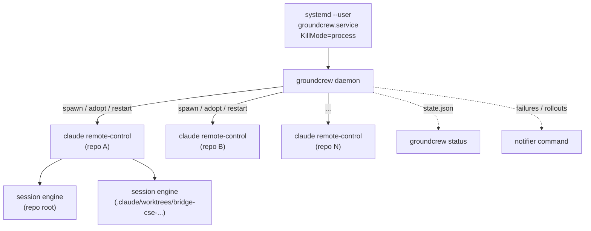

# Architecture

Each supervisor connects its repo to a cloud environment; sessions requested
from claude.ai run as engine child processes, each in an isolated git worktree
under `<repo>/.claude/worktrees/`.

## Why restarts are safe

Session identity lives server-side. Restarting a supervisor in the same
directory reconnects the same cloud environment and the same sessions; worktree
sessions re-materialize lazily on next use. The CLI garbage-collects *clean*
worktrees on shutdown but preserves *dirty* ones (and their branches), so
uncommitted in-flight work survives any restart. All of this was verified
empirically against Claude Code 2.1.x before groundcrew was built.

Because remote-control engines never populate the session `status` field,
busy/idle is inferred: a repo is restartable once every one of its sessions has
had no transcript writes for 15 minutes.

## The loop

| Cadence | Work |
|---|---|
| 30 s | Reconcile: spawn missing supervisors, respawn dead ones (crash-loop breaker: 3 deaths in 10 min → 30 min backoff + a notification), retire unregistered repos when quiet |
| hourly | Per repo: freshness pull → the post-pull hook when the default branch moved in-tree → drift restart when all sessions are quiet |
| nightly 04:00 | `claude update` as a backstop for the native auto-updater |

Spawns are rate-limited to a few per reconcile pass: registering many
environments at once trips the API's 429 rate limit and the rejected
supervisors exit. Cold starts, mass restarts, and fleet-wide drift updates all
ramp through this gate. Supervisors always run the native installer's binary
(`~/.local/bin/claude`), never a PATH/shim lookup — a repo's mise config may
pin its own `claude`, which must not become the supervisor.

**Drift** covers both the binary version and the launch arguments. Each
supervisor's argv is derived from its repo's effective settings with defaults
emitted explicitly, so a live process's command line always states its
configuration; a supervisor differing from the desired (version, args) pair
restarts once quiet, through the ramp. That makes "edit config, restart the
daemon" the entire reconfiguration story — there is no hot reload, because a
daemon restart is free (children survive and are re-adopted, hand-started
supervisors included, whatever their spawn mode) and adopted supervisors with
stale arguments converge as args-drift.

Repos configured with `spawn = "same-dir"` run every session in the repo
root, so freshness pulls are skipped whenever such a repo has any live
session — quiet is not enough when the working tree is shared.

Pull policy: on the default branch and clean → `git pull --ff-only`; parked on
another branch → `git fetch origin main:main` (updates the ref, never touches
the working tree); on the default branch but dirty → fetch only, plus a status
warning. Only modified *tracked* files count as dirty. A diverged local
default branch is classified as `diverged` — a warning for a human, not an
infrastructure failure, so it never triggers the consecutive-failure alert.

The daemon exits without touching its children (`KillMode=process`,
`start_new_session`); the next daemon instance re-adopts them from `/proc` by
cmdline + cwd, so groundcrew's own restarts never bounce the fleet.

## Known limits

- Worktree sessions spawn from the repo's current HEAD, not the default
  branch — keep repos parked on their default branch; `status` warns when one
  isn't.
- A session doing a >15-minute silent tool run can be mistaken for idle and
  restarted; the conversation resumes and dirty files survive, but that turn's
  remaining work is lost.
- Resume after SIGKILL is untested; groundcrew always tries SIGTERM first and
  escalates only after 60 s.
