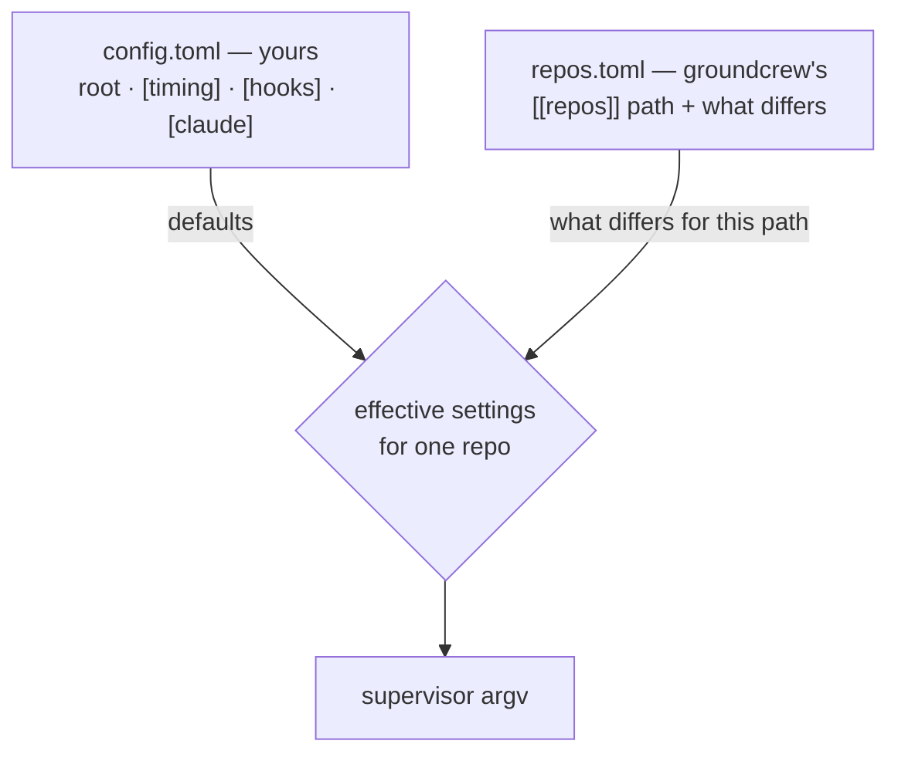

# Configuration

Two files live in `~/.config/groundcrew/` (XDG-aware). `config.toml` holds the
global settings and is yours; groundcrew never writes it. `repos.toml` is the
registry, one entry per managed directory, carrying the settings that differ
from the globals. groundcrew owns that file: `add` and `remove` rewrite it, and
comments in it are not preserved.



No config file means the built-in defaults — every key below shows its
default:

```toml
root = "~/Projects"          # where repos are discovered

[timing]
quiet_seconds = 900          # transcript-quiet window before restarts
tick_seconds = 3600          # freshness pull cadence
nightly_hour = 4             # local hour of the `claude update` backstop

[hooks]
post_pull_timeout = 600
```

Validation is strict: an unknown key, a wrong type, or a bad value anywhere
fails the load with the exact key path named, and the daemon exits with
status 78 (`EX_CONFIG`) — the systemd unit marks that exit
restart-preventing (the launchd wrapper converts it to a stop), so a typo
halts the service instead of restart-looping it.

Environment variables override everything, mainly for tests:
`GROUNDCREW_ROOT`, `GROUNDCREW_CONFIG_DIR`, `GROUNDCREW_REGISTRY`,
`GROUNDCREW_STATE`, `GROUNDCREW_CLAUDE_HOME`, `GROUNDCREW_CLAUDE_JSON`.
Protective tunables (spawn ramp, crash breaker, backoff, alert thresholds)
are deliberately constants, not config.

## Supervisor settings

Global launch settings live in `[claude]` — `spawn`
(`"worktree"`/`"same-dir"`), `capacity`, `permission_mode`,
`create_session_in_dir` (default `true`; `false` passes
`--no-create-session-in-dir` so no session is pre-created in the repo root),
and `bin`, the one binary every supervisor runs.

A registry entry may carry any of those except `bin`, plus `post_pull`:

```toml
[[repos]]
path = "/home/user/Projects/atc"

[[repos]]
path = "/home/user/Sync/Working"
spawn = "same-dir"
create_session_in_dir = true
```

Each setting is optional. An absent one inherits the global default from
`[claude]` or `[hooks]`; an explicit `post_pull = []` disables the hook for
that repo. Changing a setting takes effect through drift: restart the daemon
and each affected supervisor converges once its sessions are quiet. Neither
file has a hot reload.

`groundcrew add` writes them, and it is add-or-update: run it against an
already-registered path and it changes only the settings you name, leaving the
rest alone. With no flags, adding a registered path stays a no-op.

```sh
groundcrew add ~/Projects/atc --capacity 8 --permission-mode acceptEdits
groundcrew add ~/Sync/Working --spawn same-dir --post-pull "mise install"
groundcrew add ~/Projects/atc --no-post-pull    # post_pull = [], hook off here
```

| Flag | Effect |
|---|---|
| `--spawn {worktree,same-dir}` | how sessions get their working directory |
| `--capacity N` | concurrent sessions the supervisor accepts |
| `--permission-mode MODE` | one of `acceptEdits`, `auto`, `bypassPermissions`, `default`, `dontAsk`, `plan` |
| `--create-session-in-dir` / `--no-create-session-in-dir` | pre-create a session in the repo root, or don't |
| `--post-pull "mise install"` | the hook command, shell-split into an array |
| `--no-post-pull` | writes `post_pull = []`, disabling the hook for this repo |

`--post-pull` and `--no-post-pull` are mutually exclusive.

### Migrating settings out of `config.toml`

These settings used to live in `config.toml` as `[repos."<path>"]` tables, and
groundcrew moves them itself on the first run after the upgrade. Each table
merges into the matching `repos.toml` entry, the tables come out of
`config.toml`, and the original file is left as `config.toml.bak`. A table
naming a directory that is not registered is dropped, and the report names it
and the settings it held. A `repos.toml` still in the old flat-list form is
read as written and rewritten as `[[repos]]` entries the next time anything
writes it.

The migration doesn't guess. It moves tables written as `[repos."<path>"]`
headers at the start of a line, one directory per table. An indented header,
the inline form `repos = { "/a" = { capacity = 1 } }`, or two keys spelling
one directory (`~/Working` alongside `/home/you/Working`) abort it with both
files untouched. The error names which case it hit, and exit 78 stops the
daemon. Rewrite those tables as plain column-0 `[repos."<path>"]` headers with
one directory each, or move them into `repos.toml` as `[[repos]]` entries
yourself and delete them from `config.toml`.

### Directories git does not manage

A registered directory need not be a git repository. `groundcrew add` infers
`spawn = "same-dir"` for one and reports what it did:

```
added /home/user/Sync/Working — not a git repository, so spawn = "same-dir"; trust seeded
```

Passing `--spawn worktree` for a non-git directory is still refused: worktree
spawns need a repository to create worktrees in, and the daemon holds the same
line if the setting changes later. Freshness pulls report `not-a-repo` and do
nothing.

### What `create_session_in_dir` costs

`create_session_in_dir` also decides whether a supervisor restart keeps its
cloud environment, since the replacement reconnects through the in-dir session.
Setting it to `false` keeps every session in an isolated worktree and leaves the
repo root untouched, at the cost of making restarts destructive — so stops then
wait for the repo's sessions to end. See [restart-safety.md](restart-safety.md).

## Notifications

groundcrew has no built-in alert providers (ADR 0001) — it runs the command
you configure, passing the alert title and message both as the two appended
arguments (`$1`, `$2`) and as `GROUNDCREW_TITLE` / `GROUNDCREW_MESSAGE` in
the environment. The notifier inherits the daemon's environment, so secrets
from the env file flow through. A failing or slow notifier (30 s timeout) is
logged and never retried; with no command configured, alerts are logged as
suppressed.

```toml
[notify]
command = ["/path/to/notifier"]
```

`contrib/notify-pushover` is a four-line Pushover notifier: copy it onto
your PATH (or point `command` at the file) and put `PUSHOVER_TOKEN` /
`PUSHOVER_USER` in the env file. Alerts fire on: crash loops, three
consecutive pull failures for a repo, post-pull hook failures, `claude
update` failures, a restart that interrupts live sessions, a drift restart
still deferred after 24 hours, and (the one success ping) a completed
fleet-wide version rollout.

## The post-pull hook

When a repo's default branch moves under an in-tree pull, groundcrew runs
the configured `post_pull` command in the repo root — toolchain refresh for
mise, pnpm, cargo, whatever fits. One command per scope; compose multi-step
setups in a script or `sh -c`. A registry entry's own `post_pull` replaces the
global wholesale, and an explicit `post_pull = []` disables the hook for that
repo. Parked repos never run it (their working tree didn't change). Failures
warn in `status` and notify immediately.

```toml
[hooks]
post_pull = ["mise", "install"]
```
