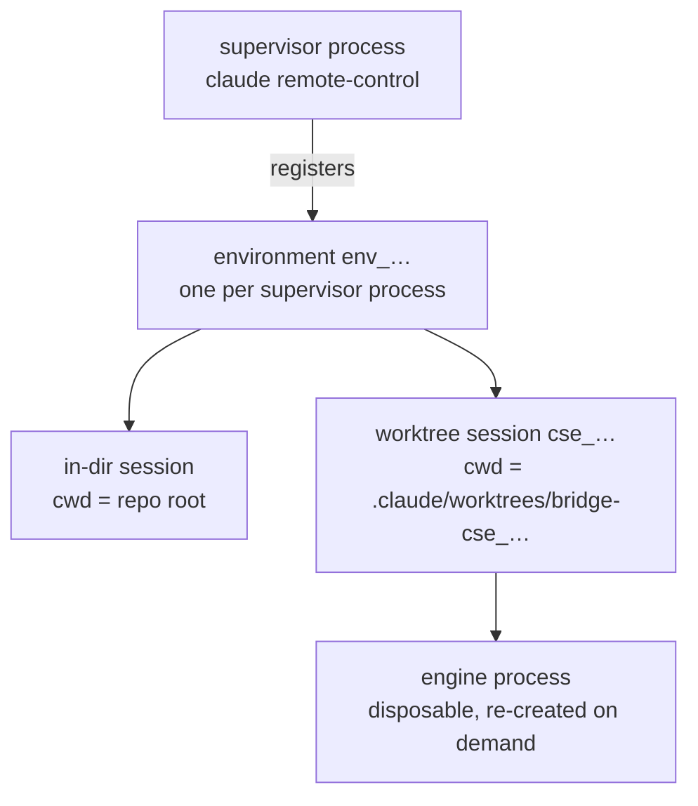
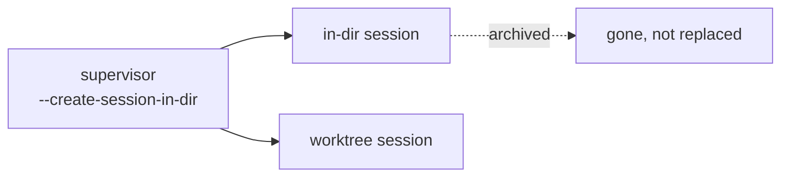
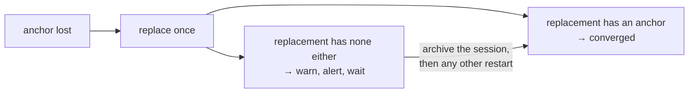

# Restart safety

Supervisors are replaced routinely: version drift, argument drift, and
retirement all stop one process and start another. Whether the sessions under
it survive depends on `create_session_in_dir`.

## The layers



Session state lives server-side. The engine process serving a session is
disposable: a session is owned by one engine at a time, and a new engine evicts
the previous one. A worktree's directory name carries the id of the session
that owns it — `bridge-cse_…` for session `cse_…`.

The environment is the supervisor's registration: one process, one environment,
for that process's lifetime.

## The in-dir session

`create_session_in_dir` (default on) pre-creates a session in the repo root. A
replacement supervisor started in the same directory reconnects to the previous
environment through that session, picks it back up, and logs `Environment
preserved.` on exit. This works after SIGKILL as well as SIGTERM.

The environment survives; an on-demand worktree session may not. Treat a
restart as costing every session it interrupts.

The anchor session is otherwise inert, and the rest of the daemon treats it that
way: a freshness pull defers to a root session only while that session is
working, so an idle anchor never blocks one.

With `create_session_in_dir = false` there is no session in the repo root.
Every start registers a new environment and abandons the previous one's
sessions. Their worktrees stay on disk with nothing that owns them, and neither
the supervisor's command line nor its log reports the loss.

Dirty worktrees survive either way. The CLI removes *clean* spawned worktrees
on shutdown and keeps *dirty* ones with their branches, so uncommitted work is
orphaned rather than destroyed.

## Archiving a session

Archiving a session in the web UI ends it everywhere, not just in the browser.
The engine process exits, its metadata file under `~/.claude/sessions/` is
removed, the supervisor's capacity drops by one, and the supervisor logs a clean
completion rather than the failure line that normally ends a session:

```
[19:30:45] Session completed (1h 3m 18s) cse_…
```

The supervisor itself keeps running, and it does not create a replacement.



So archiving the in-dir session leaves a supervisor whose command line still
says `--create-session-in-dir` with no anchor behind it. The flag outlives the
session it named, which is why the survival gate asks whether a root session
exists rather than reading the flag.

Archiving is also the way to release a stop by hand. A repo that defers
indefinitely — sessions that never go quiet, or no anchor to reconnect through —
converges as soon as its sessions are archived.

## Losing the anchor

A supervisor loses its anchor two ways: the session is archived, or the
session's engine fails on resume. In the second case the replacement supervisor
reattaches the session, the engine exits within seconds, and capacity returns to
zero:

```
·|· Connecting · Working · HEAD
    Capacity: 1/32 · Attached
[04:29:34] Session failed: Process exited with error cse_01Ho7…
·✔︎· Ready · Working · HEAD
    Capacity: 0/32
```

The result is the same either way, because the anchor is created once at
startup and never re-created. The supervisor keeps serving sessions. Its next
restart abandons the environment, and until then every drift restart defers.

groundcrew treats a lost anchor as a third kind of drift, alongside a stale
binary and stale launch arguments. It replaces the supervisor through the same
two gates and the same spawn ramp. A supervisor that is still starting has no
anchor yet, so the check waits out a grace window first.

It replaces the supervisor once. If the replacement also comes up anchorless,
the session is broken and further restarts will not help. groundcrew stops
there: `status` shows a warning, and a deferral lasting more than a day raises
an alert.

Archiving the session repairs it, but not immediately. groundcrew cannot observe
an archive, because a supervisor that lost its anchor and a repo with nothing
left to reattach both report zero sessions. The brake holds until something else
replaces the supervisor, such as a new `claude` release or an edited setting.
That replacement finds nothing to reattach, creates a fresh anchor, and clears
the brake.

Waiting is safe. The repo keeps serving sessions, and a supervisor with live
sessions and no anchor already defers its stops. It stops converging, and
`status` reports that.



## The two gates

Stopping a supervisor — for drift or for retirement — requires both:

| Gate | Question | Cost when wrong |
|---|---|---|
| quiet | Has every session been transcript-silent for the quiet window? | that session's current turn |
| survival | Is a session still sitting in the repo root, or are there no sessions at all? | the whole environment |

The survival gate asks about the anchor that exists *now*, not the one the
supervisor was launched to create. `--create-session-in-dir` in a running
process's argv records the request, not the result, and archiving leaves the
flag behind. Both have to hold — launched with an anchor, and one still there.

Both gates count only the supervisor's own sessions, not every Claude process
in the directory. Session metadata records the owner in `bridgeSessionId`, which
only engines carry. A headless `claude -p` run reports the same `entrypoint` as
an engine, so `entrypoint` cannot tell the two apart. A cron routine in a
supervised directory neither dies with the supervisor nor delays its restart.

A repo running without an in-dir session defers until its sessions end, and
`groundcrew status` reports the deferral. Version convergence waits on that, so
a repo whose sessions never end stays on its launched version until they are
archived or the supervisor is replaced by hand. A deferral still standing after 24 hours raises
an alert, and so does a stop that goes ahead with sessions that have taken a
turn. An unused anchor is discarded silently, having no turn to lose.

## Busy sessions that read as idle

remote-control engines do not populate the session `status` field, so busy/idle
is inferred from transcript modification time. A session waiting on a
background task writes nothing to its transcript, so silence alone does not
distinguish a build that has been running for an hour from a finished turn.

The transcript still records the wait. A backgrounded run is announced as
`background (ID: x)` and reported finished by a `<task-notification>` naming
the same `x`, so an id with no matching notification is a task still running.
A session holding one is never quiet, however long its transcript has been
silent.

That covers backgrounded runs, which is where long waits collect. A tool
running in the foreground past the quiet window is still indistinguishable from
an idle session.

## Reattach flags

`--continue` and `--session-id` reattach a single session recorded in the last
few hours. Both are rejected alongside `--spawn`, `--capacity`, and
`--create-session-in-dir`, so a supervisor running several sessions cannot use
either.
