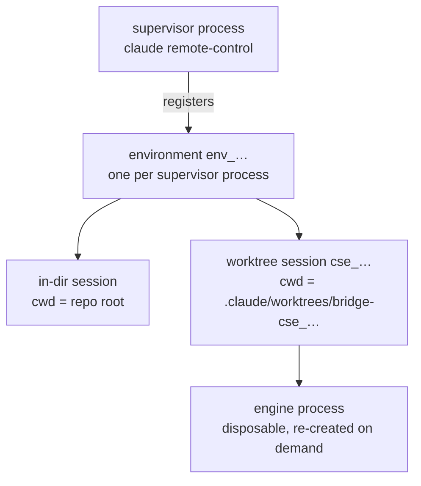

# Restart safety

Supervisors are replaced routinely: version drift, argument drift, and
retirement all stop one process and start another. Whether the sessions under
it survive depends on `create_session_in_dir`.

## The layers

Session state lives server-side. The engine process serving a session is
disposable: a session is owned by one engine at a time, and a new engine evicts
the previous one. A worktree's directory name carries the id of the session
that owns it — `bridge-cse_…` for session `cse_…`.

The environment is the supervisor's registration: one process, one environment,
for that process's lifetime.

## The in-dir session

`create_session_in_dir` (default on) pre-creates a session in the repo root. A
replacement supervisor started in the same directory reconnects to the previous
environment through that session, picks it back up, and logs `Environment
preserved.` on exit. This works after SIGKILL as well as SIGTERM.

The environment survives; an on-demand worktree session may not. Treat a
restart as costing every session it interrupts.

With `create_session_in_dir = false` there is no session in the repo root.
Every start registers a new environment and abandons the previous one's
sessions. Their worktrees stay on disk with nothing that owns them, and neither
the supervisor's command line nor its log reports the loss.

Dirty worktrees survive either way. The CLI removes *clean* spawned worktrees
on shutdown and keeps *dirty* ones with their branches, so uncommitted work is
orphaned rather than destroyed.

## The two gates

Stopping a supervisor — for drift or for retirement — requires both:

| Gate | Question | Cost when wrong |
|---|---|---|
| quiet | Has every session been transcript-silent for the quiet window? | that session's current turn |
| survival | Is there an in-dir session, or no sessions at all? | the whole environment |

A repo running without an in-dir session defers until its sessions end, and
`groundcrew status` reports the deferral. Version convergence waits on that, so
a repo whose sessions never end stays on its launched version until a
supervisor is replaced by hand. A stop that goes ahead with live sessions
interrupts them, and each loses the turn it was in.

## Busy sessions that read as idle

remote-control engines do not populate the session `status` field, so busy/idle
is inferred from transcript modification time. A session waiting on a
background task writes nothing to its transcript, so it reads as idle for as
long as the wait runs.

The transcript still records the wait: a task announced as `background (ID: x)`
with no later `<task-notification>` naming `x` had not finished.

## Reattach flags

`--continue` and `--session-id` reattach a single session recorded in the last
few hours. Both are rejected alongside `--spawn`, `--capacity`, and
`--create-session-in-dir`, so a supervisor running several sessions cannot use
either.
